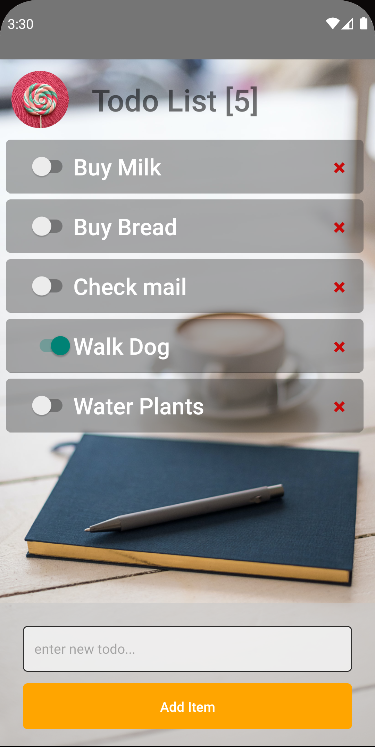

# ReactNative basic todo App

A Basic React Native TODO application

## Table of contents

- [Overview](#overview)
  - [Functionality](#functions)
  - [Screenshot](#screenshot)
  - [Links](#links)
- [My process](#my-process)
  - [Built with](#built-with)
  - [What I learned](#what-i-learned)
  - [Continued development](#continued-development)
  - [Useful resources](#useful-resources)
- [Author](#author)
- [Acknowledgments](#acknowledgments)

## Overview

### Functionality Provided

- Allow user to add a todo
- Allow user to remove a todo
- Allow user to mark todo as "complete"

### Screenshot

### Links

- Solution URL: [gitHub](https://github.com/Drakan21/ReactNative_TODOApp)

## My process

### Built with

- React native
- JavaScript / TypeScript

### What I learned

- Setup of a React native development environment
- Setup of emulation device for testing/deployment
- React native implementation

### Continued development

- Group todos by date, or potentially by category.

### Useful resources

- [ReactNative](https://reactnative.dev/)

## Author

- Twitter - [@drakanion](https://www.twitter.com/drakanion)
- GitHub - [Drakan21/GitHub](https://github.com/Drakan21)
